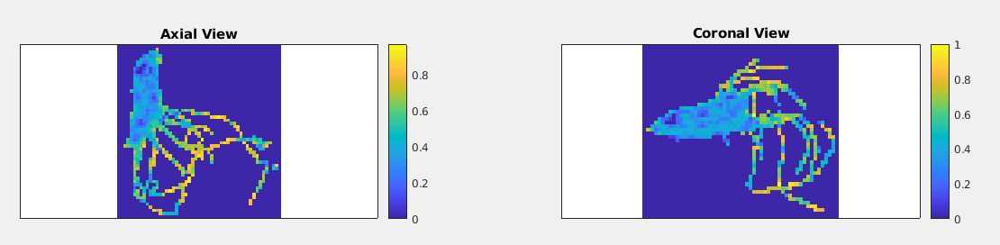
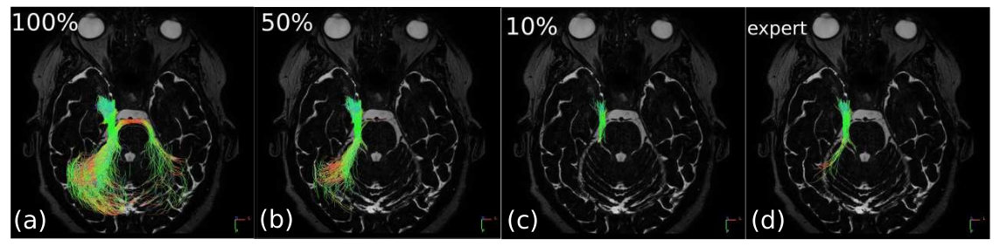
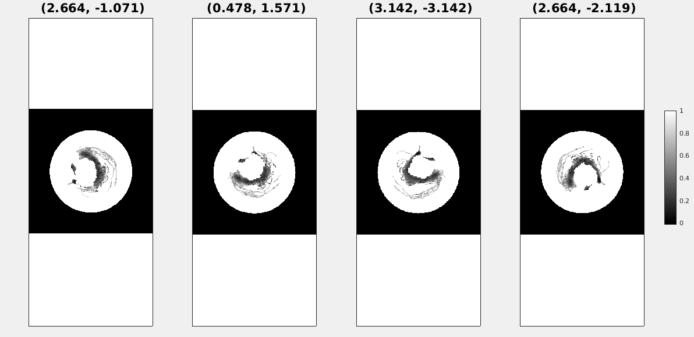
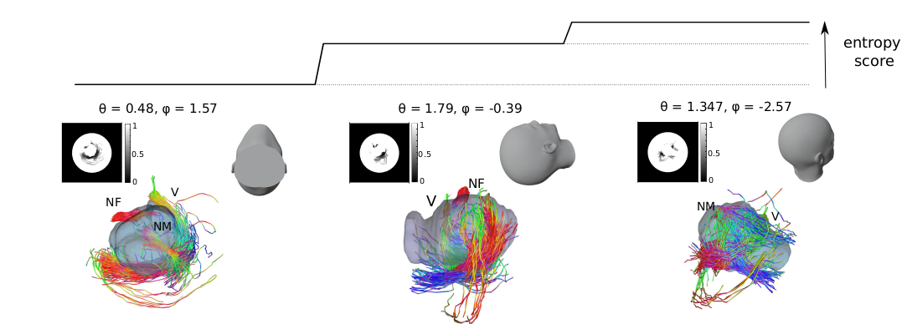

# Entropy-based tractography visualization tool

This codes provides tools for the visualization of tractography fibers. It offers post-processing algorithms to filter the fibers and to select the best points of views on a 3D scene with nerves and tumor.

## Input data

The input data taken by this code is a file of tractography fibers produced by a tractography software. The format of the data can be **Mrtrix tck file** or **DSIstudio txt file**. If the fibers were produced by Mrtrix, please make sure to use voxel coordinates. To convert your result to voxel coordinates, you can use the function tckconvert of Mrtrix, as described in the shell script you can find on the *Shell* folder. If you want to add a segmentation to the visualization (e.g. a tumor) it must be provided as a **binary image in nifti format**. The segmentations made using DSIstudio are compatible with the code, but any other segmentation might result in wrong placement. Sample data of tracked cranial nerves and cranial tumor segmentation is provided in the *Data* folder. 

## Filtering

A **filtering algorithm** based on the computation of the entropy of the tractography fibers is proposed. An example of use of this algorithm is given in the *main* file. To perform the filtering, you must first compute the entropy of the fibers using the *Entropy/entropy_matrix* function. 

Then, run *Filtering/filter_nerve* to remove the fibers which are less meaningful for the visualization. You must provide the **percentage of fibers** you want to keep as argument. If you don't, the algorithm will automatically compute the best percentage. The filtered fibers are writen as **DSIstudio txt file**. 

## Viewpoint selection

A selection of the **best viewpoints** on a 3D scene of fibers (or fibers + tumor) can be done after the entropy matrix of the object of interest is computed. For this, run *Viewpoint/find_best_views*. The **number of angles** to try is given by the user. An ordered list of the best angles and the corresponding projections is output, as well as a **txt file of camera position** to be used in DSIstudio. 

## Code optimization

 The MATLAB code provided is compatible with the use of C/C++ code generated from MATLAB files for speed up. In the *Codegen* folder you will find the function to be wrapped in C/C++. You can do it using the codegen command of MATLAB as explained in *Codegen/mexfile.sh* of use the provided mex functions (they might not be compatible with your system) and rename them *entropy_3D_codegen* and *reorient_codegen*.

## Output data

Althought the output of the filtering and viewpoint selection can be visualized directly in MATLAB with the given codes, we advice you to use a dedicated software such as DSIstudio for a better rendering. In DSIstudio, open the *.fib* environnement file. Then, you can load txt fiber file, tumor segmentation and camera positions provided by the present code. 

Please address any questions or problem concerning the code to meghane.decroocq@insa-lyon.fr.
